<div align="center">

# Fabriq Admin

### A pluggable, embeddable admin & visualization console for the [Fabriq](https://github.com/xraph/fabriq) data fabric

Browse entities, run vector & semantic search, explore the knowledge graph, inspect CRDT documents, plot spatial queries, read time‑series telemetry, and manage runtime plugins — all from one tenant‑aware console you can **mount into any React app** or run standalone.

<br/>


</div>

<br/>

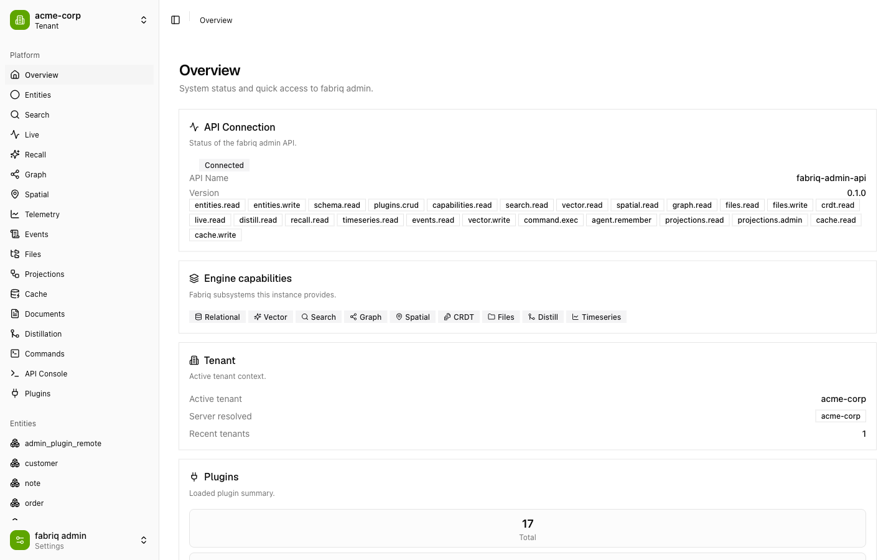

---

## Highlights

- **Library‑first, embeddable.** The entire console is a single `<FabriqAdmin>` React component. Drop it into an existing app (React Router, Next.js, or standalone), hand it a client, and it renders into your container — no page, router, or global‑CSS ownership required.
- **Runtime plugin system.** Every panel is a plugin. Built‑ins ship with the host; third‑party plugins load **at runtime over the network** via Module Federation — no rebuild, no redeploy.
- **Multi‑tenant by design.** A tenant switcher injects `X‑Tenant‑ID` on every request; all reads and writes are tenant‑scoped.
- **Surfaces every Fabriq subsystem.** Entities, Search (text/semantic/similar), Graph, Spatial, Time‑series, Files, CRDT documents, Distillation, Cache, Projections, Events, and a raw API console.
- **Scoped, themeable design system.** shadcn + [Base UI](https://base-ui.com) primitives on Tailwind v4, an OKLCH lime theme, and **zero global preflight** — all styles are scoped to `.fabriq-admin`, so it's safe to embed.

---

## Feature tour

### Overview — engine capabilities at a glance
Live API connection status, the exact capability set the backend advertises, the active tenant, and a loaded‑plugin summary.


### Entities — schema‑aware CRUD
Browse any registered entity type, page through instances, open a detail view, and create/update/delete — the grid columns are derived from the type's schema.

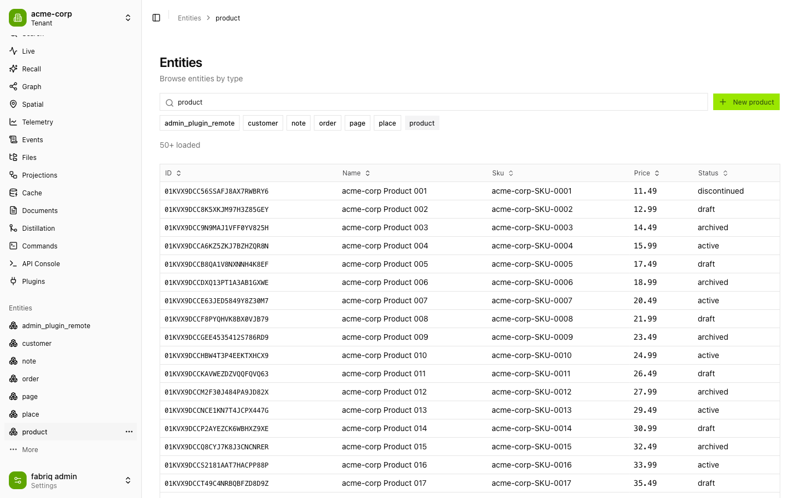

### Search — full‑text, semantic & similarity
Three modes in one panel: full‑text search, **semantic** (text → vector) search backed by pgvector, and **similar‑to‑entity** search — plus an embedding manager. Results are ranked and tenant‑scoped.

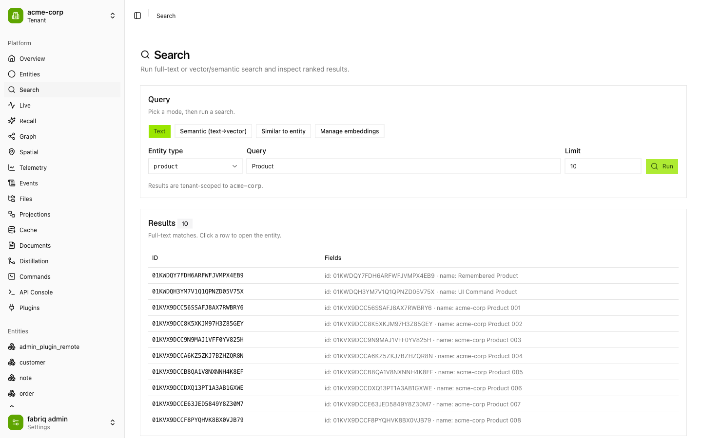

### Graph — explore the knowledge graph
Traverse relationships from any entity with a depth control, or drop into **read‑only Cypher**. Results render as an interactive d3‑force graph (drag, zoom, pan) with per‑type node coloring, backed by FalkorDB.

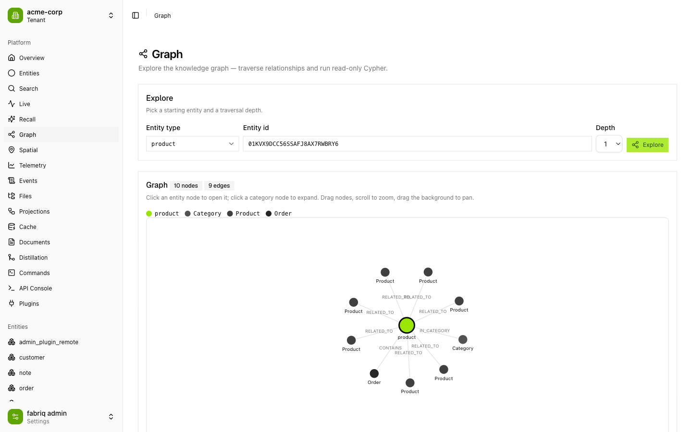

### Spatial — within‑radius geo queries
Pick a center, radius, and entity type; matches plot on a map nearest‑first (green → red), with quick city presets. Powered by Fabriq's PostGIS spatial plane.

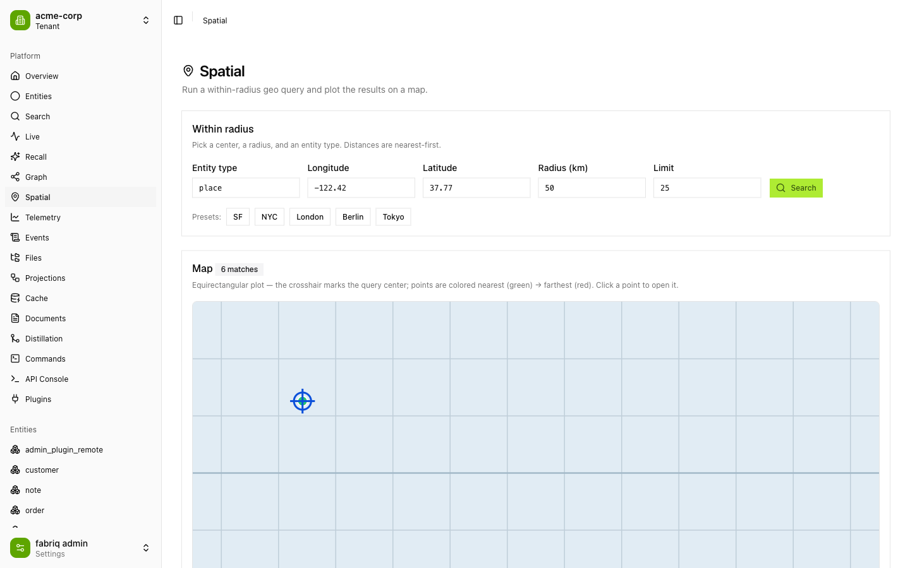

### Telemetry — time‑series signals
Read any signal from the time‑series plane — choose a look‑back window, downsampling bucket, and aggregation. Summary stats (min/max/avg/last) plus a live area chart.

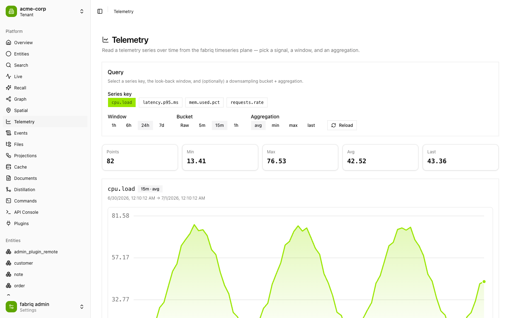

### Documents — collaborative CRDT state
Inspect a CRDT document's current merged state (replayed from its update log, merged field‑by‑field via grove‑crdt) alongside the raw update‑log metadata and high‑water sequence.

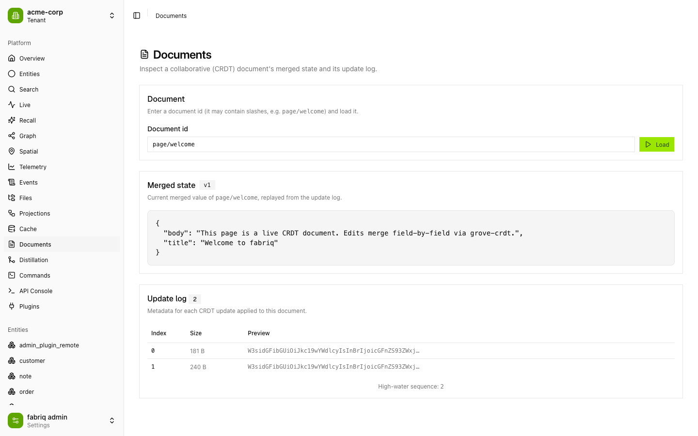

### Files — the blob/file plane
Browse the file tree, upload, download, delete, and organize — backed by Fabriq's content‑addressed file plane.

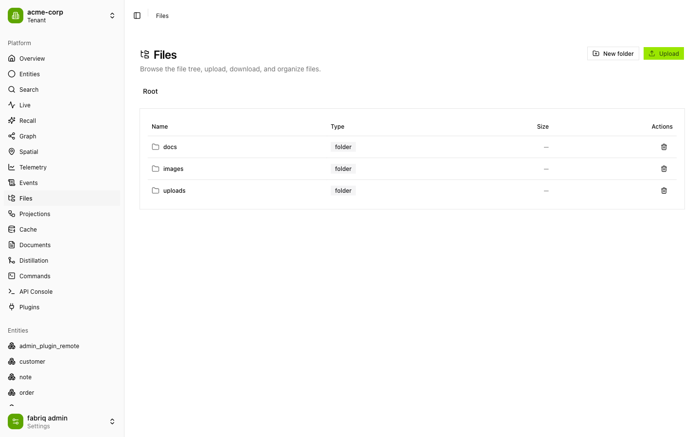

### Distillation — the "AI data fabric"
Browse the per‑tenant digest **Merkle tree**: rolled‑up summaries over your data with content and semantic hashes at every node.

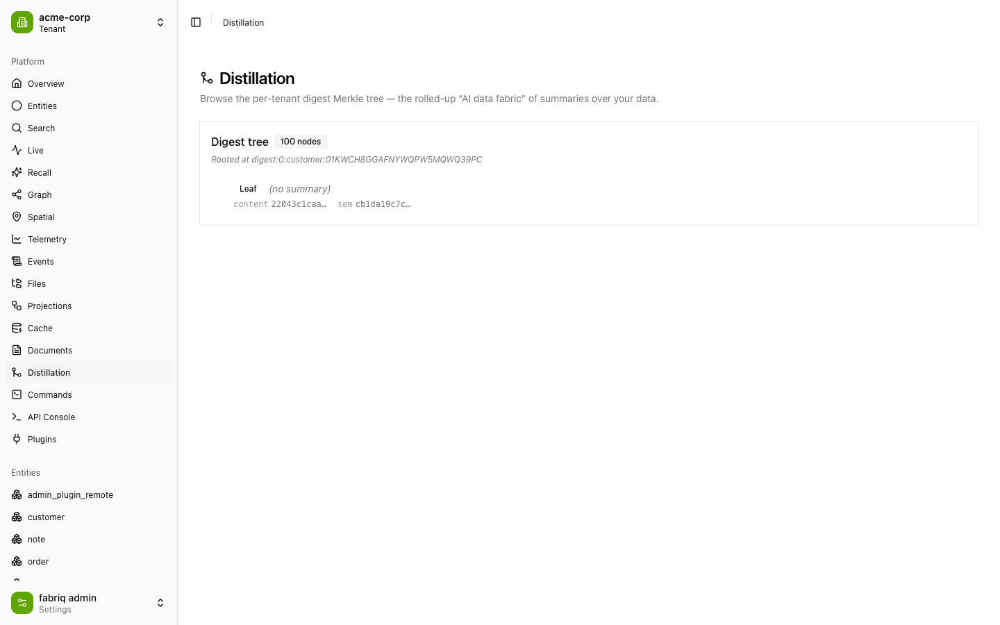

### API Console — raw request explorer
Send arbitrary requests to the admin API with presets, inspect status, timing, headers, and the pretty‑printed JSON body. The active tenant header is applied automatically.

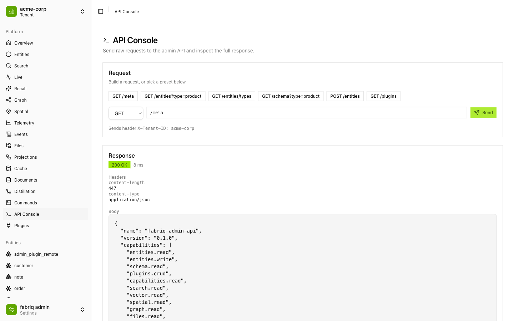

### Plugins — runtime federation manager
See every builtin and remote plugin with its source and load status, and register new remote plugins by URL at runtime.

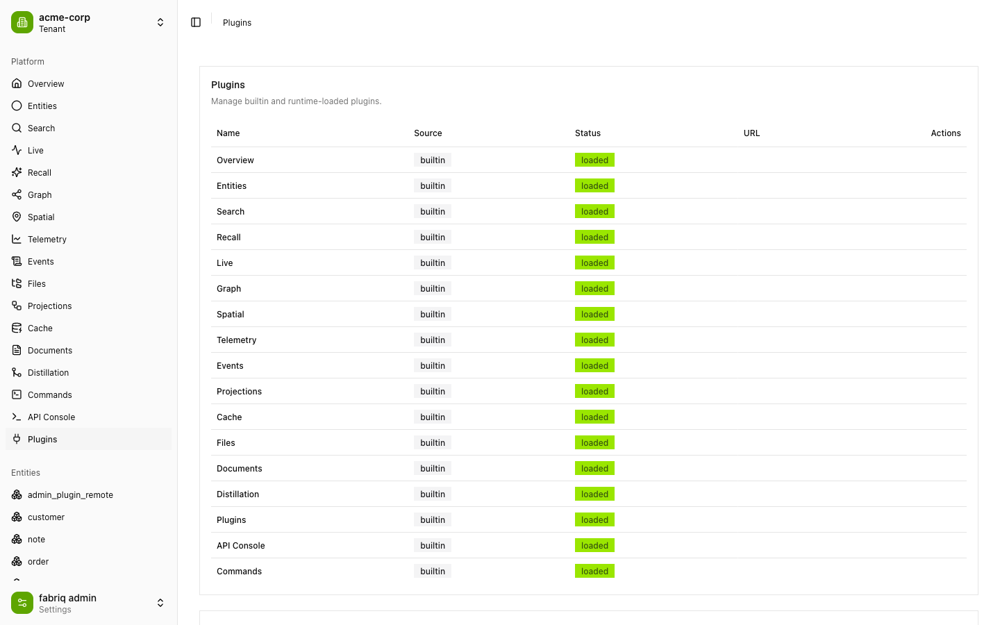

> Also included: **Live** (streaming result sets), **Recall** (agentic RAG recall), **Events** (event‑stream browsing), **Projections** (materialized view management), **Cache** (read‑through cache inspection), and **Commands** (command execution).

---

## Architecture

```
┌───────────────────────────────────────────────────────────────┐
│  Host app  (apps/host — Vite + Module Federation)             │
│                                                               │
│   <FabriqAdmin                                                │
│      client={FabriqClient}      ← HTTP/SSE transport          │
│      plugins={[…builtins]}      ← 17 builtin panels           │
│      tenantStore={…}            ← X-Tenant-ID header           │
│      loadRemote={…} />          ← runtime federation loader    │
│         │                                                     │
│         ├─ PluginRegistry  → merges routes + nav + panels     │
│         ├─ Router (virtual | hash | path)                     │
│         └─ Scoped UI (.fabriq-admin, Tailwind v4, no preflight)│
└───────────┬───────────────────────────────────┬──────────────┘
            │ REST + SSE (/admin/*)              │ setRemote()
            ▼                                    ▼
   Fabriq backend                       Remote plugins
   (forgeext/adminapi)                  (remoteEntry.js, loaded by URL)
```

**Library‑first mounting.** `<FabriqAdmin>` ([`packages/admin-sdk`](packages/admin-sdk)) owns no page and sets up no global router. It renders into the container you give it, scopes all CSS to `.fabriq-admin`, and bridges to your host router via optional `routerPush`/`routerReplace` props. Routing strategy is selectable: `virtual` (in‑memory, embed‑safe), `hash`, or `path`.

**Runtime Module Federation.** The host ([`apps/host/vite.config.ts`](apps/host/vite.config.ts)) shares singletons — `react`, `react-dom`, `@tanstack/react-query`, `@fabriq/admin-sdk`, and `@fabriq/ui` — so runtime‑loaded remotes use the host's React and context instances. Remote plugins are registered by URL at runtime from the Plugins page; there are no statically‑declared remotes.

**Plugins are the unit of composition.** A plugin is a small object (`definePlugin({ id, name, capabilities, navItems, routes, panels })`). Builtins are passed to `<FabriqAdmin>` as an array; remotes are fetched, validated, and merged into the same `PluginRegistry`. An optional `PluginStore` persists remote specs (HTTP or `localStorage`) across reloads.

**Tenant‑aware transport.** `FabriqClient` wraps an injectable transport (default HTTP+SSE) whose `getHeaders()` pulls `X‑Tenant‑ID` from the `TenantStore`, so every entity read, search, graph query, and stream is tenant‑scoped.

---

## Getting started

### Prerequisites

- **Node.js** ≥ 20 and **pnpm** ≥ 9
- A running **Fabriq admin backend**. The simplest path is the demo server shipped with Fabriq (`cmd/admin-demo`), which mounts the `forgeext/adminapi` extension and seeds sample data across two tenants.

### 1. Start the backend

From your Fabriq checkout, with a dev stack up (Postgres, Elasticsearch, FalkorDB, Redis — the demo defaults match the standard dev ports):

```bash
go run ./cmd/admin-demo      # serves the admin API on http://localhost:8080/admin
```

Verify it:

```bash
curl -s localhost:8080/admin/meta -H 'X-Tenant-ID: acme-corp'
```

### 2. Start the console

```bash
pnpm install
pnpm dev                     # → http://localhost:5173
```

Open the app, click the tenant switcher, and add a tenant (e.g. `acme-corp`). Every panel is now live against the backend.

The API base URL defaults to `http://localhost:8080/admin` and can be overridden with the `VITE_FABRIQ_API_URL` environment variable.

### Optional: run the remote‑plugin example

```bash
pnpm --filter @fabriq/remote-example dev   # → http://localhost:5175 (CORS enabled)
```

Then add its `remoteEntry.js` URL from the **Plugins** page to load it into the host at runtime.

---

## Embedding in your app

```tsx
import { FabriqAdmin, FabriqClient, createHttpTransport, createTenantStore } from "@fabriq/admin-sdk"
import { builtinPlugins } from "./plugins"
import "@fabriq/ui/styles.css"

const tenantStore = createTenantStore()
const baseUrl = "https://your-host/admin"
const client = new FabriqClient({
  baseUrl,
  transport: createHttpTransport({ baseUrl, getHeaders: () => tenantStore.headers() }),
})

export function AdminRoute() {
  return (
    <FabriqAdmin
      client={client}
      plugins={builtinPlugins}
      tenantStore={tenantStore}
      theme="system"
      routing="path"
      path="/admin"
    />
  )
}
```

---

## Monorepo structure

```
fabriq-admin/
├── apps/
│   ├── host/                 @fabriq/host           — Module Federation host / dev shell
│   └── remote-example/       @fabriq/remote-example — standalone remote‑plugin example
├── packages/
│   ├── admin-sdk/            @fabriq/admin-sdk      — <FabriqAdmin>, plugin system, client, transport, router, tenant
│   └── ui/                   @fabriq/ui             — Base UI + shadcn components, scoped Tailwind v4 theme
└── plugins/                  17 builtin feature plugins
    ├── overview  entity-browser  search  recall  live  graph  spatial
    ├── telemetry  events  projections  cache  files  crdt  distill
    └── commands  api-console  plugins-manager
```

Packages are consumed as raw TypeScript source (`main: ./src/index.ts`) — no per‑package build step for local development.

### Writing a plugin

```ts
import { definePlugin } from "@fabriq/admin-sdk"
import { Boxes } from "lucide-react"
import { MyPanel } from "./MyPanel"

export default definePlugin({
  id: "acme.my-panel",
  name: "My Panel",
  version: "1.0.0",
  capabilities: ["entities.read"],
  navItems: [{ label: "My Panel", to: "/my-panel", icon: Boxes, order: 55 }],
  routes: [{ path: "/my-panel", element: <MyPanel />, title: "My Panel" }],
})
```

Build it as a Module Federation remote exposing `./plugin` (see [`apps/remote-example`](apps/remote-example)) and load it at runtime from the Plugins page — or bundle it into your host's plugin array.

---

## Tech stack

| Area | Choice |
| --- | --- |
| UI | **React 19**, TanStack Query, TanStack Table/Virtual |
| Styling | **Tailwind v4** (scoped, no preflight), Base UI + shadcn, OKLCH lime theme, `next-themes` |
| Bundling | **Vite 5** + `@vitejs/plugin-react` + `@originjs/vite-plugin-federation` |
| Visualization | `d3-force` (graph), `recharts` (telemetry) |
| Monorepo | **pnpm** workspaces |
| Testing | **Vitest** + Testing Library + jsdom |
| Language | **TypeScript 5.6** (target `esnext`) |

---

## Testing

```bash
pnpm test        # run the vitest workspace across packages, apps, and plugins
```

Unit tests run under jsdom and never touch real Module Federation or the network: the `loadRemote` prop is injectable, and a federation stub mocks `virtual:__federation__`, so plugin loading, routing, transport, and components are all tested in isolation.

---

## Backend

Fabriq Admin talks to the Fabriq **adminapi** forge extension ([`forgeext/adminapi`](https://github.com/xraph/fabriq)) over `/admin/*` REST and SSE endpoints — `meta`, `entities`, `schema`, `search`, `graph`, `spatial`, `timeseries`, `files`, `crdt`, `distill`, `recall`, `live`, `events`, `cache`, `projections`, `plugins`, and a raw command endpoint. The console probes `/meta` at startup and lights up exactly the panels the connected engine advertises as capabilities.

---

<div align="center">
<sub>Part of the Fabriq data‑fabric ecosystem.</sub>
</div>
